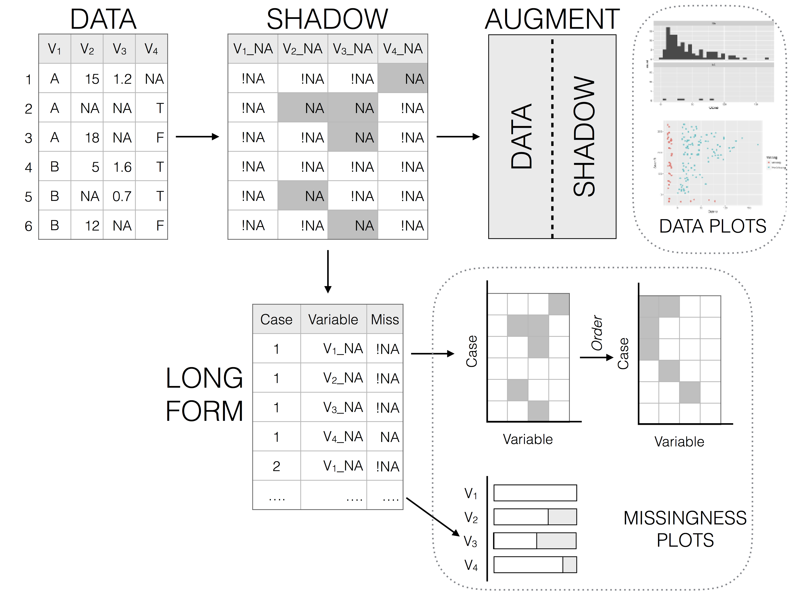

```{r knitr-setup, include = FALSE}
knitr::opts_chunk$set(fig.align = "center",
                      fig.width = 5,
                      fig.height = 4,
                      dpi = 100)

```


# Introduction

Missing values are ubiquitous in data and need to be carefully explored and handled in the initial stages of analysis. In this vignette we describe the tools in the package `naniar` for exploring missing data structures with minimal deviation from the common workflows of ggplot and tidy data [@Wickham2014; @Wickham2009].

Sometimes researchers or analysts will introduce or describe a mechanism for missingness. For example, they might explain that data from a weather station might have a malfunction when there are extreme weather events, and does not record temperature data when gusts speeds are high. This seems like a nice simple, logical explanation. However, like all good explanations, this one is simple, but the process to get there was probably not, and likely involved more time than you would have liked developing exploratory data analyses and models. 

So when someone presents a really nice plot and a nice sensible explanation, the initial thought might be:

> They worked it out themselves so quickly, so easy!

As if the problem was so easy to solve, they could _accidentally_ solve it - they couldn't not solve it. 

However, I think that if you manage to get that on the first go, that is more like turning around and throwing a rock into a lake and it landing in a cup in a boat. Unlikely.

With that thought in mind, this vignette aims to work with the following three questions, using the tools developed in `naniar` and another package, `visdat`. Namely, how do we:

1. Start looking at missing data? 
2. Explore missingness mechanisms? 
3. Model missingness?

# How do we start looking at missing data?

When you start with a dataset, you might do something where you look at the general summary, using functions such as:

- `summary()`
- `str()`
- [`skimr::skim`](https://github.com/ropenscilabs/skimr), or
- `dplyr::glimpse()`

These works really well when you've got a small amount of data, but when you have more data, you are generally limited by how much you can read.

So before you start looking at missing data, you'll need to look at the data, but what does that even mean?

The package `visdat` helps you get a handle on this. `visdat` provides a visualisation of an entire data frame at once, and was heavily inspired by [`csv-fingerprint`](http://setosa.io/blog/2014/08/03/csv-fingerprints/), and functions like `missmap`, from `Amelia`.

There are two main functions in the `visdat` package:

- `vis_dat`, and
- `vis_miss`

## `vis_dat`

```{r vis-dat, echo = TRUE}
library(visdat)
vis_dat(airquality)

```

`vis_dat` visualises the whole dataframe at once, and provides information about the class of the data input into R, as well as whether the data is missing or not.

### `vis_miss`

The function `vis_miss` provides a summary of whether the data is missing or not. It also provides the amount of missings in each columns.


```{r vis-miss-cluster-vanilla}

vis_miss(airquality)

```

So here, Ozone and Solar.R have the most missing data, with Ozone having 24.2% missing data and Solar.R have 4.6%. The other variables do not have any missing data.

To read more about the functions available in `visdat` see the vignette ["Using visdat"](https://CRAN.R-project.org/package=visdat/vignettes/using_visdat.html)

# Exploring missingness relationships

We can identify key variables that are missing using `vis_miss`, but for further exploration, we need to explore the relationship amongst the variables in this data:

- Ozone,
- Solar.R 
- Wind
- Temp
- Month
- Day

Typically, when exploring this data, you might want to explore the variables Solar.R and Ozone, and so plot a scatterplot of solar radiation and ozone, doing something like this:

```{r example-geom-point, echo = TRUE, fig.width = 5, fig.height=3}
library(ggplot2)
ggplot(airquality, 
       aes(x = Solar.R, 
           y = Ozone)) + 
  geom_point()
```

The problem with this is that ggplot does not handle missings be default, and removes the missing values. This makes them hard to explore. It also presents the strange question of "how do you visualise something that is not there?".  One approach to visualising missing data comes from [`ggobi`](http://www.ggobi.org/) and [`manet`](http://www.rosuda.org/MANET/), where we replace "NA" values with values 10% lower than the minimum value in that variable. 

This process is performed and visualised for you with the `geom_miss_point()` ggplot2 geom. Here, we illustrate by exploring the relationship between Ozone and Solar radiation from the airquality dataset.

```{r geom-miss-point, echo = TRUE, out.width = "50%", fig.show='hold'}

ggplot(airquality, 
       aes(x = Solar.R, 
           y = Ozone)) + 
  geom_point()

library(naniar)

ggplot(airquality, 
       aes(x = Solar.R, 
           y = Ozone)) + 
  geom_miss_point()

```

Being a proper ggplot geom, it supports all of the standard features of ggplot2, such as **facets**,

```{r ggmissing-facet, echo = TRUE, out.width = "70%"}

ggplot(airquality, 
       aes(x = Solar.R, 
           y = Ozone)) + 
  geom_miss_point() + 
  facet_wrap(~Month)

```

And different **themes**

```{r ggmissing-theme, echo = TRUE, out.width = "70%"}

ggplot(airquality, 
       aes(x = Solar.R, 
           y = Ozone)) + 
  geom_miss_point() + 
  facet_wrap(~Month) + 
  theme_dark()

```

## Visualising missings in variables

Another approach to visualising the missings in a dataset is to use the `gg_miss_var` plot:

```{r gg-miss-var}

gg_miss_var(airquality)

```

The plots created with the `gg_miss` family all have a basic theme, but you can customise them, and add arguments like so:

```{r gg-miss-var-theme}
gg_miss_var(airquality) + theme_bw() 

gg_miss_var(airquality) + labs(y = "Look at all the missing ones")

```

To add facets in these plots, you can use the `facet` argument:

```{r gg-miss-var-facet}
gg_miss_var(airquality, facet = Month)
```

There are more visualisations available in `naniar` (each starting with `gg_miss_`) - you can see these in the ["Gallery of Missing Data Visualisations" vignette.](https://cran.r-project.org/package=naniar/vignettes/naniar-visualisation.html).


It is important to note that for every visualisation of missing data in `naniar`, there is an accompanying function to get the dataframe of the plot out. This is important as the plot should not return a dataframe - but we also need to make the data available for use by the user so that it isn't locked into a plot. You can find these summary plots below, with `miss_var_summary` providing the dataframe that `gg_miss_var()` is based on.

# Replacing existing values with NA

When you are dealing with missing values, you might want to replace values with
a missing values (NA). This is useful in cases when you know the origin of the
data and can be certain which values should be missing. For example, you might
know that all values of "N/A", "N A", and "Not Available", or -99, or -1 are
supposed to be missing.

`naniar` provides functions to specifically work on this type of problem using
the function `replace_with_na`. This function is the compliment to
`tidyr::replace_na`, which replaces an NA value with a specified value, whereas
`naniar::replace_with_na` replaces a value with an NA:

- `tidyr::replace_na`: Missing values turns into a value (NA --> -99)
- `naniar::replace_with_na`: Value becomes a missing value (-99 --> NA)

You can read more about this in the vignette ["Replacing values with NA"](http://naniar.njtierney.com/articles/replace-with-na.html)

# Tidy Missing Data: The Shadow Matrix

Representing missing data structure in a tidy format is achieved using the shadow matrix, introduced in [Swayne and Buja](https://www.researchgate.net/publication/2758672_Missing_Data_in_Interactive_High-Dimensional_Data_Visualization). The shadow matrix is the same dimension as the data, and consists of binary indicators of missingness of data values, where missing is represented as "NA", and not missing is represented as "!NA". Although these may be represented as 1 and 0, respectively. This representation can be seen in the figure below, adding the suffix "_NA" to the variables. This structure can also be extended to allow for additional factor levels to be created. For example 0 indicates data presence, 1 indicates missing values, 2 indicates imputed value, and 3 might indicate a particular type or class of missingness, where reasons for missingness might be known or inferred. The data matrix can also be augmented to include the shadow matrix, which facilitates visualisation of univariate and bivariate missing data visualisations. Another format is to display it in long form, which facilitates heatmap style visualisations. This approach can be very helpful for giving an overview of which variables contain the most missingness. Methods can also be applied to rearrange rows and columns to find clusters, and identify other interesting features of the data that may have previously been hidden or unclear. 

```{r mds-fig, out.width = "800px", echo = F}

```

__Illustration of data structures for facilitating visualisation of missings and not missings__

The `shadow` functions provide a way to keep track of missing values. The `as_shadow` function creates a dataframe with the same set of columns, but with the column names added a suffix `_NA`

```{r as-shadow}

as_shadow(airquality)

```

The `bind_shadow` argument attaches a shadow to the current dataframe

```{r bind-shadow, echo = TRUE}

aq_shadow <- bind_shadow(airquality)

library(dplyr)

glimpse(aq_shadow)

```

Doing this provides a consistent syntax for referring to variables with missing values.

`bind_shadow()` also provides a useful pattern to explore missing values, grouping by the missing/complete of one variable and looking at the mean and other summary values. Below we show the mean, sd, variance, and min and max values of Solar.R for when Ozone is present, and when it is missing.

```{r bind-shadow-pattern}

airquality %>%
  bind_shadow() %>%
  group_by(Ozone_NA) %>%
  summarise_at(.vars = "Solar.R",
               .funs = c("mean", "sd", "var", "min", "max"),
               na.rm = TRUE)
```


Below, we can plot the distribution of Temperature, plotting for values of temperature when Ozone is missing, and when it is not missing.

```{r shadow-plot, echo = TRUE, out.width = "60%"}

ggplot(aq_shadow,
       aes(x = Temp,
           colour = Ozone_NA)) + 
  geom_density()

```

Binding the shadow here also has great benefits when combined with imputation.

# Visualising imputed values
https://cran.r-project.org/package=naniar
With the easy-to-use [`simputation`](https://cran.r-project.org/package=simputation) package, we impute values for Ozone, then visualise the data:

```{r simpute-invisible, echo = TRUE, fig.height = 3}

library(simputation)
library(dplyr)

airquality %>%
  impute_lm(Ozone ~ Temp + Wind) %>%
  ggplot(aes(x = Temp,
             y = Ozone)) + 
  geom_point()
  
```

Note that we no longer get any errors regarding missing observations - because they are all imputed! But this comes at a cost: we also no longer have information about where the imputations are - they are now sort of invisible.

Using the shadow matrix to keep track of where the missings are, you can actually keep track of the imputations, by colouring by what was previously missing in Ozone.

```{r simpute-visible, echo = TRUE, fig.height = 3}

aq_shadow %>%
  impute_lm(Ozone ~ Temp + Wind) %>%
  ggplot(aes(x = Temp,
             y = Ozone,
             colour = Ozone_NA)) + 
  geom_point()
  
```

## Numerical summaries of missing values

`naniar` also provide numerical summaries for missing data. Two convenient counters of complete values and missings are `n_miss` and `n_complete`. These work on both dataframes and vectors, similar to `dplyr::n_distinct`

```{r helpers-n-miss, echo = TRUE}

dplyr::n_distinct(airquality)
dplyr::n_distinct(airquality$Ozone)

n_miss(airquality)
n_miss(airquality$Ozone)

n_complete(airquality)
n_complete(airquality$Ozone)

```

The syntax for the other numerical sumamries in `naniar` are `miss_`, and then `case`, or `var` to refer to cases or variables. There are then `summary`, `table`, `run`, `span`, and `cumsum` options to explore missing data.

The

`miss_case_prop` and `miss_case_pct` return numeric value describing the proportion or percent of missing values in the dataframe.

```{r miss-case-prop}
miss_case_prop(airquality)
miss_case_pct(airquality)
```

`miss_case_summary` returns a numeric value that describes the number of missings in a given case (aka row), the percent of missings in that row.

```{r miss-case-summary}

miss_case_summary(airquality)

```

`miss_case_table` tabulates the number of missing values in a case / row. Below, this shows the number of missings in a case:

- There are 111 cases with 0 missings, which comprises about 72% of the data.
- There are then 40 cases with 1 missing, these make up 26% of the data.
- There are then 2 cases with 2 missing - these make up 1% of the data.

```{r miss-case-table}

miss_case_table(airquality)

```

Similar to `miss_case_pct()` and `miss_case_prop()`, `miss_var_pct()` and `miss_var_prop()` returns the percent and proportion of variables that contain a missing value.

```{r miss-var-prop}

miss_var_prop(airquality)
miss_var_pct(airquality)

```

`miss_var_summary` then returns the number of missing values in a variable, and the percent missing in that variable.

```{r miss-var-summary}

miss_var_summary(airquality)

```

Finally, `miss_var_table`. This describes the number of missings in a variable.

- There are 4 variables with 0 missings, comprising 66.67% of variables in the dataset.
- There is 1 variable with 7 missings
- There is 1 variable with 37 missings

```{r miss-var-table}

miss_var_table(airquality)

```

There are also summary functions for exploring missings that occur over a particular span or period of the dataset, or the number of missings in a single run:

- `miss_var_run()`, and 
- `miss_var_span()`

`miss_var_run` can be particularly useful in time series data, as it allows you to provide summaries for the number of missings or complete values in a single run. The function `miss_var_run()` provides a data.frame of the run length of missings and complete values. To explore this function we will use the built-in dataset, `pedestrian`, which contains hourly counts of pedestrians from four locations around Melbourne, Australia, from 2016.

To use `miss_var_run`, you specify the variable that you want to explore the runs of missingness for, in this case, `hourly_counts`:

```{r miss-var-run}
miss_var_run(pedestrian,
             hourly_counts)
```

`miss_var_span()` is used to determine the number of missings over a specified repeating span of rows in variable of a dataframe. Similar to `miss_var_run()`, you specify the variable that you wish to explore, you then also specify the size of the span with the `span_every` argument.

```{r ped-miss-var-span}

miss_var_span(pedestrian,
              hourly_counts,
              span_every = 100)

```

# Using `group_by` with naniar

Every `miss_*` summary function that returns a dataframe can be used with dplyr `group_by`. For example, if you would like to look at the number of missing values for all variables of pedestrian data.

```{r ped-miss-var-sum}

pedestrian %>% miss_var_summary()

```

We see that this is in `hourly_counts`. We can then explore this by month, and filder by the variable being `hourly_counts`, since it is the only one with missing values.

```{r ped-group-by-miss-var-sum}

pedestrian %>%
 group_by(month) %>%
 miss_var_summary() %>%
 filter(variable == "hourly_counts")

```


# Modelling missingness

The final question we proposed in this vignette was: 

3. Can we model missingness?

Sometimes it can be impractical to explore all of the variables that have missing data. One approach, however, is to model missing data using methods from Tierney et el. (2015).

Here, the approach is to predict the proportion of missingness in a given case, using all variables. There is a little helper function to add a column with the proportion of cases or rows missing - `add_prop_miss`. This created a column named "prop_miss", which is the proportion of missing values in that row.

```{r add-prop-miss, echo = TRUE}

airquality %>%
  add_prop_miss() %>%
  head()

```

We can then use a model like decision trees to predict which variables and their values are important for predicting the proportion of missingness:

```{r rpart-miss, echo = TRUE}

library(rpart)
library(rpart.plot)

airquality %>%
  add_prop_miss() %>%
  rpart(prop_miss_all ~ ., data = .) %>%
  prp(type = 4, extra = 101, prefix = "Prop. Miss = ")

# library(visdat)
# vis_miss(messy_airquality)
```

Here we can see that this produces quite a complex tree - this can be pruned back and the depth of the decision tree controlled.

# Summary

The tools in `naniar` help us identify where missingness is, while maintaining a tidy workflow. We care about these mechanisms or these patterns because they can help us understand potential mechanisms, such as equipment failures, and then identify possible solutions based upon this evidence.
	  
# Future development

- Make `naniar` work with big data tools like `sparklyr`, and `sparklingwater`.
- Further develop methods for handling and visualising imputations, and multiple imputation.
Other plans to extend the `geom_miss_` family to include:
- Categorical variables
- Bivariate plots: scatterplots, density overlays
- Provide tools for assessing goodness of fit for classical approaches of MCAR, MAR, and MNAR (graphical inference from `nullabor` package)

# Thank you

Firstly, thanks to Di Cook for giving the initial inspiration for the package and laying down the rich theory and literature that the work in `naniar` is built upon.
Naming credit (once again!) goes to Miles McBain. Among various other things, Miles also worked out how to overload the missing data and make it work as a geom. Thanks also to Colin Fay for helping me understand tidy evaluation and for features such as `replace_with_na`, `miss_*_cumsum`, and more.

# References

- MANET: http://www.rosuda.org/MANET/
- ggobi: http://www.ggobi.org/
- visdat: https://www.github.com/ropensci/visdat
- Tierney NJ, Harden FA, Harden MJ, Mengersen, KA, Using decision trees to understand structure in missing data BMJ Open 2015;5:e007450. doi: 10.1136/bmjopen-2014-007450
